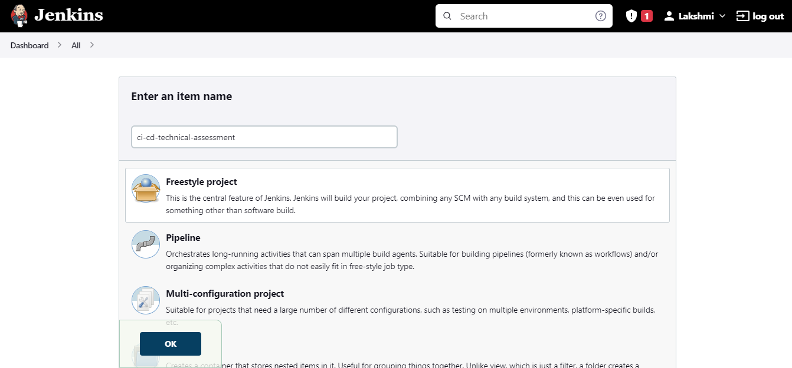
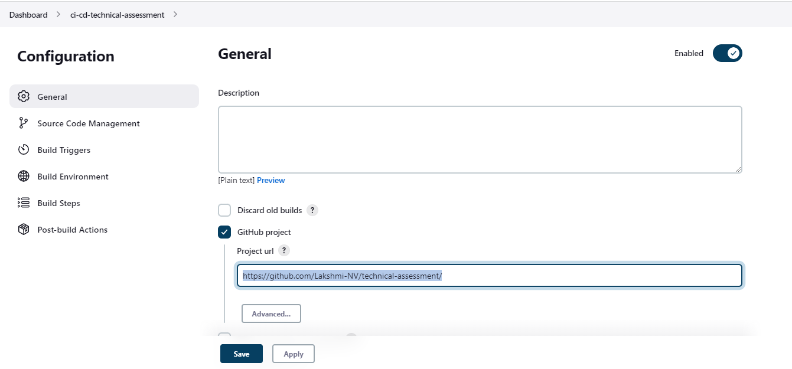
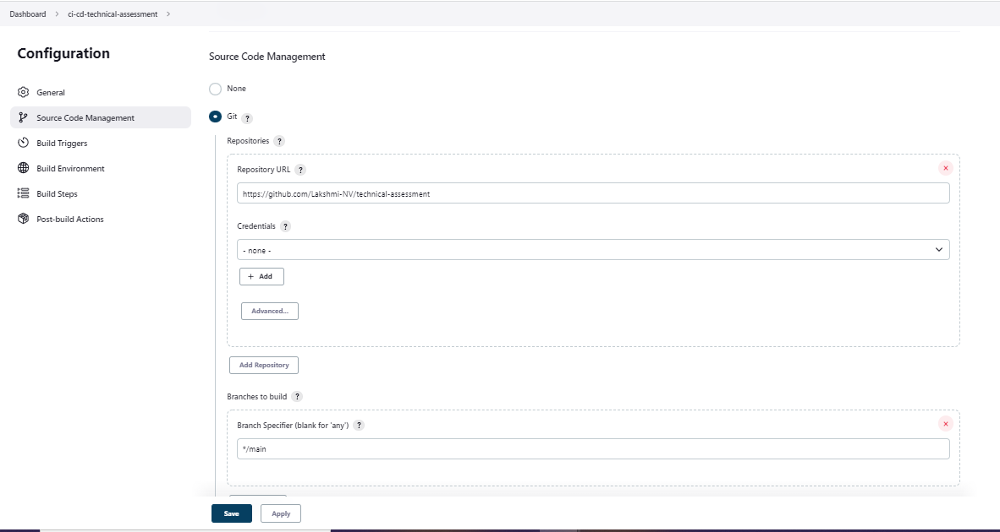
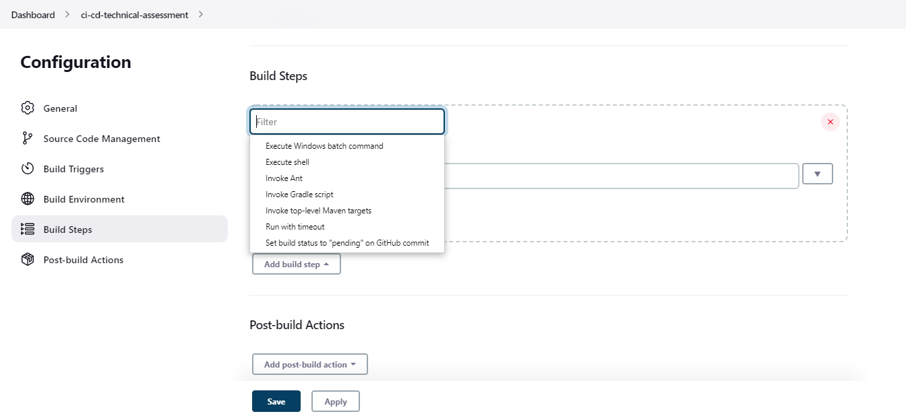
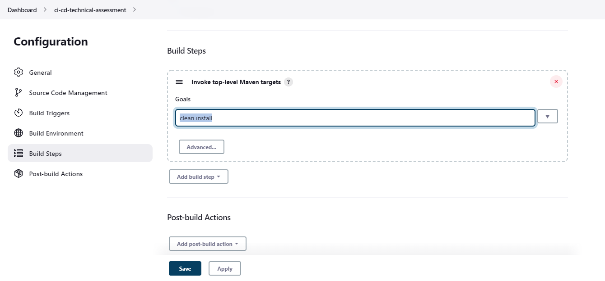
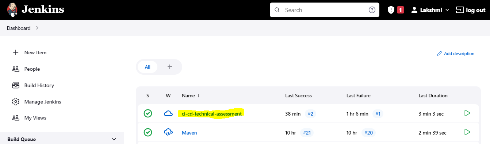
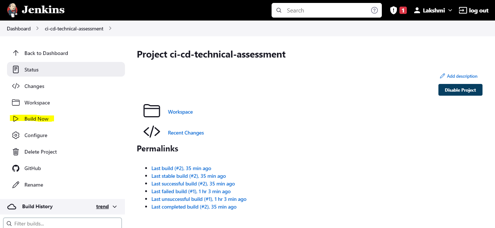
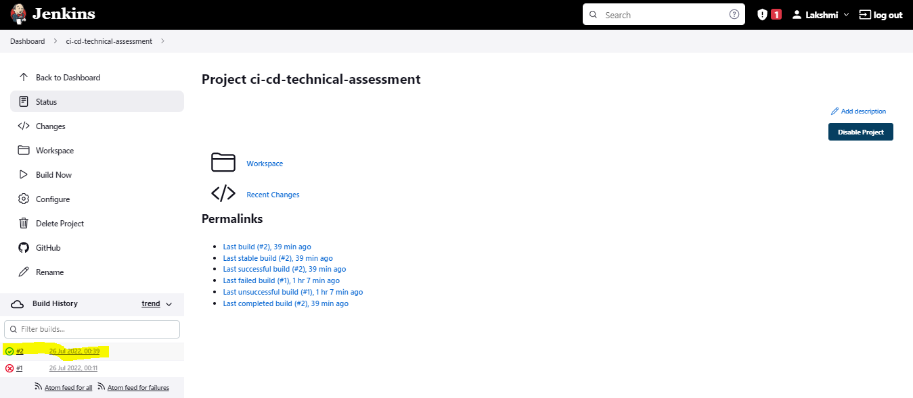

# technical-assessment

# UI Test Automation Framework

This repository contains the framework used for technical assessment UI automation.

## CI CD Pipeline Setup

To Confgure Jenkins Job:

- Install Jenkins
- Open Jenkins
- Click on **New Item** link to create a job in jenkins.



- Enter an item name, in our case its `ci-cd-technical-assessment` click on FreeStyle Project and click on `OK`

- Select "GitHub Project" in General Tab, and provide this github URL. `https://github.com/Lakshmi-NV/technical-assessment`



- Update the following details in "Source Code Management" Tab, Select "Git" and provide git repository URL and specify the branch, in my case its `*/main`.



- Scroll down to `Build` option. Click on `Add Build Step` and choose the value `Invoke top-level Maven targets` from the drop down list.



- Enter Goals “clean install”



- Save the Job.

- We have created a new project `ci-cd-technical-assessment` with the configuration to execute Maven Project using Jenkins.



- To Execute, Click on `Build Now` button.



- Right click on Build Number (here in my case it is #2) and click on Console Output to see the result. You could see Build Status `Success` on Console Output.



- Refer the output log of my execution.

```text
Started by user Lakshmi
Running as SYSTEM
Building in workspace C:\ProgramData\Jenkins\.jenkins\workspace\ci-cd-technical-assessment
The recommended git tool is: NONE
No credentials specified
 > git.exe rev-parse --resolve-git-dir C:\ProgramData\Jenkins\.jenkins\workspace\ci-cd-technical-assessment\.git # timeout=10
Fetching changes from the remote Git repository
 > git.exe config remote.origin.url https://github.com/Lakshmi-NV/technical-assessment # timeout=10
Fetching upstream changes from https://github.com/Lakshmi-NV/technical-assessment
 > git.exe --version # timeout=10
 > git --version # 'git version 2.32.0.windows.1'
 > git.exe fetch --tags --force --progress -- https://github.com/Lakshmi-NV/technical-assessment +refs/heads/*:refs/remotes/origin/* # timeout=10
 > git.exe rev-parse "refs/remotes/origin/main^{commit}" # timeout=10
Checking out Revision d81c635f72201d34e7a746ac44cfc2c92af60c46 (refs/remotes/origin/main)
 > git.exe config core.sparsecheckout # timeout=10
 > git.exe checkout -f d81c635f72201d34e7a746ac44cfc2c92af60c46 # timeout=10
Commit message: "Adding Execution Code for Jenkins Setup"
 > git.exe rev-list --no-walk d81c635f72201d34e7a746ac44cfc2c92af60c46 # timeout=10
[ci-cd-technical-assessment] $ cmd.exe /C "mvn clean install && exit %%ERRORLEVEL%%"
[INFO] Scanning for projects...
[INFO] 
[INFO] -------------------------< Academy:E2EProject >-------------------------
[INFO] Building E2EProject 1.0-SNAPSHOT
[INFO] --------------------------------[ jar ]---------------------------------
[INFO] 
[INFO] --- maven-clean-plugin:2.5:clean (default-clean) @ E2EProject ---
[INFO] Deleting C:\ProgramData\Jenkins\.jenkins\workspace\ci-cd-technical-assessment\target
[INFO] 
[INFO] --- maven-resources-plugin:2.6:resources (default-resources) @ E2EProject ---
[WARNING] File encoding has not been set, using platform encoding Cp1252, i.e. build is platform dependent!
[WARNING] Using platform encoding (Cp1252 actually) to copy filtered resources, i.e. build is platform dependent!
[INFO] Copying 4 resources
[INFO] 
[INFO] --- maven-compiler-plugin:3.1:compile (default-compile) @ E2EProject ---
[INFO] Changes detected - recompiling the module!
[WARNING] File encoding has not been set, using platform encoding Cp1252, i.e. build is platform dependent!
[INFO] Compiling 3 source files to C:\ProgramData\Jenkins\.jenkins\workspace\ci-cd-technical-assessment\target\classes
[INFO] 
[INFO] --- maven-resources-plugin:2.6:testResources (default-testResources) @ E2EProject ---
[WARNING] Using platform encoding (Cp1252 actually) to copy filtered resources, i.e. build is platform dependent!
[INFO] skip non existing resourceDirectory C:\ProgramData\Jenkins\.jenkins\workspace\ci-cd-technical-assessment\src\test\resources
[INFO] 
[INFO] --- maven-compiler-plugin:3.1:testCompile (default-testCompile) @ E2EProject ---
[INFO] Changes detected - recompiling the module!
[WARNING] File encoding has not been set, using platform encoding Cp1252, i.e. build is platform dependent!
[INFO] Compiling 2 source files to C:\ProgramData\Jenkins\.jenkins\workspace\ci-cd-technical-assessment\target\test-classes
[INFO] 
[INFO] --- maven-surefire-plugin:2.20:test (default-test) @ E2EProject ---
[INFO] 
[INFO] -------------------------------------------------------
[INFO]  T E S T S
[INFO] -------------------------------------------------------
[INFO] Running TestSuite
chrome
Starting ChromeDriver 103.0.5060.134 (8ec6fce403b3feb0869b0732eda8bd95011d333c-refs/branch-heads/5060@{#1262}) on port 24917
Only local connections are allowed.
Please see https://chromedriver.chromium.org/security-considerations for suggestions on keeping ChromeDriver safe.
ChromeDriver was started successfully.
Jul 26, 2022 12:39:53 AM org.openqa.selenium.remote.ProtocolHandshake createSession
INFO: Detected dialect: W3C
Number of cells In Row 0 are 0
-------------------------------------------------- 
Number of cells In Row 1 are 7
Cell Value of row number 1 and column number 0 Is Iuvaret0
Cell Value of row number 1 and column number 1 Is Apeirian0
Cell Value of row number 1 and column number 2 Is Adipisci0
Cell Value of row number 1 and column number 3 Is Definiebas0
Cell Value of row number 1 and column number 4 Is Consequuntur0
Cell Value of row number 1 and column number 5 Is Phaedrum0
Cell Value of row number 1 and column number 6 Is edit delete
-------------------------------------------------- 
Number of cells In Row 2 are 7
Cell Value of row number 2 and column number 0 Is Iuvaret1
Cell Value of row number 2 and column number 1 Is Apeirian1
Cell Value of row number 2 and column number 2 Is Adipisci1
Cell Value of row number 2 and column number 3 Is Definiebas1
Cell Value of row number 2 and column number 4 Is Consequuntur1
Cell Value of row number 2 and column number 5 Is Phaedrum1
Cell Value of row number 2 and column number 6 Is edit delete
-------------------------------------------------- 
Number of cells In Row 3 are 7
Cell Value of row number 3 and column number 0 Is Iuvaret2
Cell Value of row number 3 and column number 1 Is Apeirian2
Cell Value of row number 3 and column number 2 Is Adipisci2
Cell Value of row number 3 and column number 3 Is Definiebas2
Cell Value of row number 3 and column number 4 Is Consequuntur2
Cell Value of row number 3 and column number 5 Is Phaedrum2
Cell Value of row number 3 and column number 6 Is edit delete
-------------------------------------------------- 
Number of cells In Row 4 are 7
Cell Value of row number 4 and column number 0 Is Iuvaret3
Cell Value of row number 4 and column number 1 Is Apeirian3
Cell Value of row number 4 and column number 2 Is Adipisci3
Cell Value of row number 4 and column number 3 Is Definiebas3
Cell Value of row number 4 and column number 4 Is Consequuntur3
Cell Value of row number 4 and column number 5 Is Phaedrum3
Cell Value of row number 4 and column number 6 Is edit delete
-------------------------------------------------- 
Number of cells In Row 5 are 7
Cell Value of row number 5 and column number 0 Is Iuvaret4
Cell Value of row number 5 and column number 1 Is Apeirian4
Cell Value of row number 5 and column number 2 Is Adipisci4
Cell Value of row number 5 and column number 3 Is Definiebas4
Cell Value of row number 5 and column number 4 Is Consequuntur4
Cell Value of row number 5 and column number 5 Is Phaedrum4
Cell Value of row number 5 and column number 6 Is edit delete
-------------------------------------------------- 
Number of cells In Row 6 are 7
Cell Value of row number 6 and column number 0 Is Iuvaret5
Cell Value of row number 6 and column number 1 Is Apeirian5
Cell Value of row number 6 and column number 2 Is Adipisci5
Cell Value of row number 6 and column number 3 Is Definiebas5
Cell Value of row number 6 and column number 4 Is Consequuntur5
Cell Value of row number 6 and column number 5 Is Phaedrum5
Cell Value of row number 6 and column number 6 Is edit delete
-------------------------------------------------- 
Number of cells In Row 7 are 7
Cell Value of row number 7 and column number 0 Is Iuvaret6
Cell Value of row number 7 and column number 1 Is Apeirian6
Cell Value of row number 7 and column number 2 Is Adipisci6
Cell Value of row number 7 and column number 3 Is Definiebas6
Cell Value of row number 7 and column number 4 Is Consequuntur6
Cell Value of row number 7 and column number 5 Is Phaedrum6
Cell Value of row number 7 and column number 6 Is edit delete
-------------------------------------------------- 
Number of cells In Row 8 are 7
Cell Value of row number 8 and column number 0 Is Iuvaret7
Cell Value of row number 8 and column number 1 Is Apeirian7
Cell Value of row number 8 and column number 2 Is Adipisci7
Cell Value of row number 8 and column number 3 Is Definiebas7
Cell Value of row number 8 and column number 4 Is Consequuntur7
Cell Value of row number 8 and column number 5 Is Phaedrum7
Cell Value of row number 8 and column number 6 Is edit delete
-------------------------------------------------- 
Number of cells In Row 9 are 7
Cell Value of row number 9 and column number 0 Is Iuvaret8
Cell Value of row number 9 and column number 1 Is Apeirian8
Cell Value of row number 9 and column number 2 Is Adipisci8
Cell Value of row number 9 and column number 3 Is Definiebas8
Cell Value of row number 9 and column number 4 Is Consequuntur8
Cell Value of row number 9 and column number 5 Is Phaedrum8
Cell Value of row number 9 and column number 6 Is edit delete
-------------------------------------------------- 
Number of cells In Row 10 are 7
Cell Value of row number 10 and column number 0 Is Iuvaret9
Cell Value of row number 10 and column number 1 Is Apeirian9
Cell Value of row number 10 and column number 2 Is Adipisci9
Cell Value of row number 10 and column number 3 Is Definiebas9
Cell Value of row number 10 and column number 4 Is Consequuntur9
Cell Value of row number 10 and column number 5 Is Phaedrum9
Cell Value of row number 10 and column number 6 Is edit delete
-------------------------------------------------- 
Test completed
No of rows are : 10
No of cols are : 7
Test completed
Answer: 83886
Test completed
qux
Answer: 83886
baz
Answer: 71707
Test completed
https://the-internet.herokuapp.com/challenging_dom#delete
Test completed
https://the-internet.herokuapp.com/challenging_dom#edit
Test completed
The hardest part in automated web testing is finding the best locators (e.g., ones that well named, unique, and unlikely to change). It's more often than not that the application you're testing was not built with this concept in mind. This example demonstrates that with unique IDs, a table with no helpful locators, and a canvas element.
Test completed
Blue Button Verified
Red Button Verified
Green Button Verified
Test completed
http://elementalselenium.com/
Test completed
Test completed
[INFO] Tests run: 10, Failures: 0, Errors: 0, Skipped: 0, Time elapsed: 175.224 s - in TestSuite
[INFO] 
[INFO] Results:
[INFO] 
[INFO] Tests run: 10, Failures: 0, Errors: 0, Skipped: 0
[INFO] 
[INFO] 
[INFO] --- maven-jar-plugin:2.4:jar (default-jar) @ E2EProject ---
[INFO] Building jar: C:\ProgramData\Jenkins\.jenkins\workspace\ci-cd-technical-assessment\target\E2EProject-1.0-SNAPSHOT.jar
[INFO] 
[INFO] --- maven-install-plugin:2.4:install (default-install) @ E2EProject ---
[INFO] Installing C:\ProgramData\Jenkins\.jenkins\workspace\ci-cd-technical-assessment\target\E2EProject-1.0-SNAPSHOT.jar to C:\WINDOWS\system32\config\systemprofile\.m2\repository\Academy\E2EProject\1.0-SNAPSHOT\E2EProject-1.0-SNAPSHOT.jar
[INFO] Installing C:\ProgramData\Jenkins\.jenkins\workspace\ci-cd-technical-assessment\pom.xml to C:\WINDOWS\system32\config\systemprofile\.m2\repository\Academy\E2EProject\1.0-SNAPSHOT\E2EProject-1.0-SNAPSHOT.pom
[INFO] ------------------------------------------------------------------------
[INFO] BUILD SUCCESS
[INFO] ------------------------------------------------------------------------
[INFO] Total time:  02:59 min
[INFO] Finished at: 2022-07-26T00:42:46+05:30
[INFO] ------------------------------------------------------------------------
Finished: SUCCESS
```
